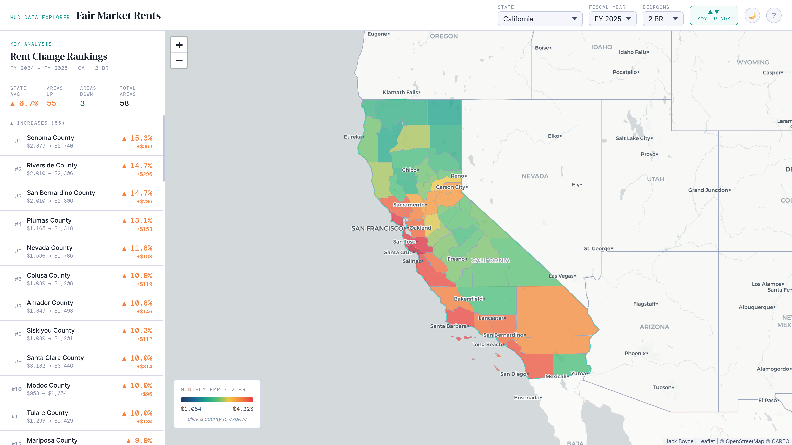
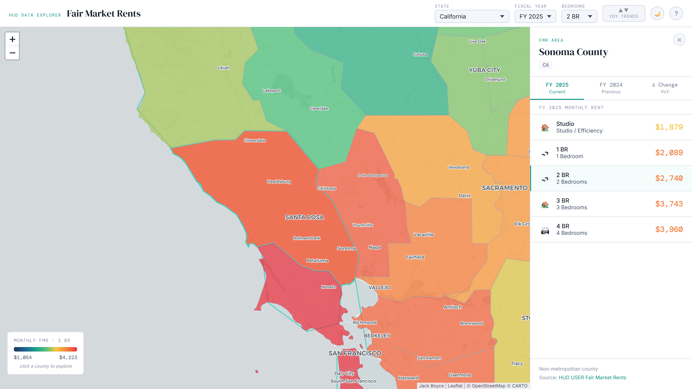

# FMR Map

**Live demo: [hudrents.com](https://hudrents.com)**

An interactive choropleth map for exploring **HUD Fair Market Rents** across the United States — built for housing researchers, voucher administrators, landlords, and anyone who needs to understand the geographic distribution of Section 8 rent limits.

---

### Year-over-Year Trends — California


### County Detail — Sonoma County, CA


---

## What are Fair Market Rents?

Fair Market Rents (FMRs) are rent estimates published annually by the U.S. Department of Housing and Urban Development (HUD). They represent the **40th percentile gross rent** for standard quality rental units in a given area — meaning 40% of recently-moved renters in that area pay at or below the FMR.

FMRs are used to set **Section 8 Housing Choice Voucher** payment standards and inform housing policy and affordability research nationwide. HUD updates FMRs every October for the new fiscal year, with data available back to FY 2017.

---

## Features

**Interactive choropleth map**
Counties are colored by rent level using a gradient from dark blue (affordable) through teal, green, amber, and orange to red (expensive). Select any state from the dropdown or click directly on the map.

**County detail panel**
Click any county to open a side panel with FMRs broken down by bedroom size — Studio through 4 BR — for the current year, previous year, and year-over-year change.

**Year-over-Year Trends panel**
Press **YOY Trends** in the header to rank every area in the state by rent change percentage. See which markets are rising fastest, with dollar and percentage change for each bedroom size.

**Bedroom & fiscal year selectors**
Switch between bedroom sizes or any fiscal year back to FY 2017 — the entire map recolors instantly.

**Light / dark mode**
Toggle between dark and light basemaps from the header. Preference is saved automatically.

**Session memory**
The last selected state is restored on return visits. First-time visitors see a guide to the app's features.

---

## Planned Features

- **Small Area FMR (SAFMR) support** — HUD has implemented ZIP-code-level FMRs in certain metropolitan areas including Massachusetts and Connecticut. A future update will detect SAFMR states and display ZIP-level rent data instead of county-level FMRs for those areas.

---

## Tech Stack

| Layer | Technology |
|---|---|
| Backend | Node.js + Express |
| HUD API proxy | `node-fetch` — API token never reaches the browser |
| Server-side cache | In-memory Map, 24-hour TTL |
| Frontend | Vanilla JavaScript (ES modules) |
| Map engine | [Leaflet.js](https://leafletjs.com/) 1.9 |
| Map tiles | CartoDB Dark Matter / Positron |
| Containerisation | Docker + Docker Compose |

---

## Getting Started

### Prerequisites

- Node.js 20+
- A free HUD USER API token from [huduser.gov](https://www.huduser.gov/hudapi/public/register)

### Run locally

```bash
git clone https://github.com/jackboyce/fmr-map.git
cd fmr-map
npm install
cp .env.example .env
# add your HUD_API_TOKEN to .env
npm start
```

Open [http://localhost:3000](http://localhost:3000).

---

## Docker Deployment

For a quick deployment without a domain (HTTP on port 3000):

```yaml
services:
  app:
    build: .
    container_name: fmr-map
    restart: unless-stopped
    env_file: .env
    ports:
      - "3000:3000"
```

```bash
docker compose up -d --build
```

See [DEPLOY.md](DEPLOY.md) for the full walkthrough including Nginx reverse proxy and TLS setup.

---

## Environment Variables

| Variable | Required | Description |
|---|---|---|
| `HUD_API_TOKEN` | Yes | Bearer token from HUD USER API |
| `PORT` | No | Server port (default: 3000) |

The `.env` file is never committed or baked into the Docker image — it is injected at runtime via `env_file` in `docker-compose.yml`.

---

## Data Sources

- **[HUD USER API](https://www.huduser.gov/hudapi/public)** — Fair Market Rent data
- **US Census Bureau TIGER/Line** — County boundary polygons
- **Natural Earth** — US state boundary polygons

---

## License

MIT — Built by [Jack Boyce](https://github.com/jackboyce/fmr-map)
